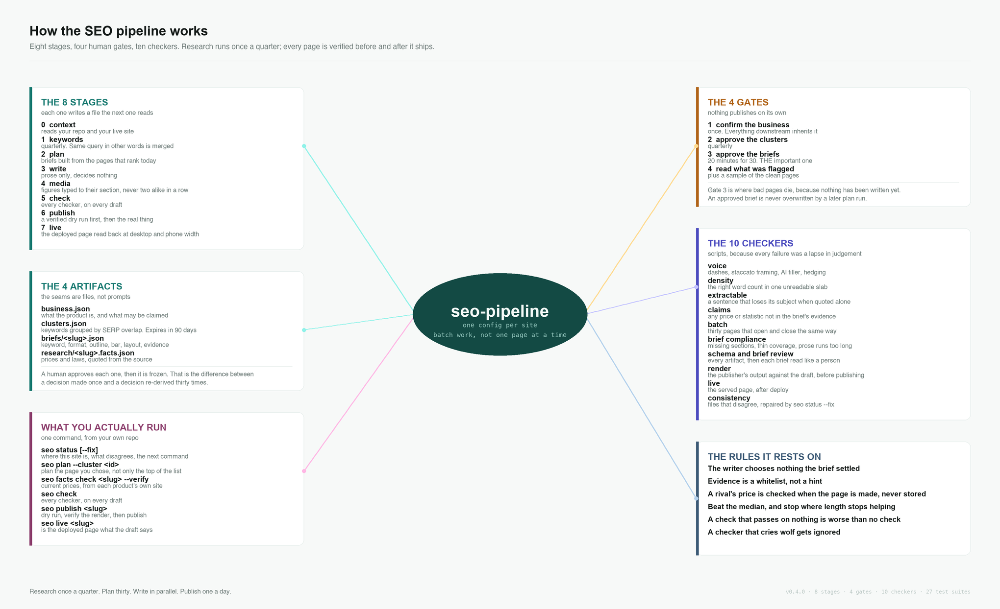

# SEO Pipeline



<sub>Dark version: <code>docs/mindmap-dark.png</code>. Regenerate either with <code>python3 docs/make_mindmap.py [--dark]</code>.</sub>

An SEO content system for people who ship their own product. It reads your repo to learn what
you built, pulls every keyword your competitors already rank for, groups them by what actually
ranks, tears down the pages you have to beat, and turns all of that into briefs a writer follows
exactly.

Research runs once a quarter and feeds thirty pages. Not once per page.

```bash
seo doctor      # is this machine set up
seo status      # where this site is, and the one command to run next
```

## How it works

**Every stage writes a file the next stage reads, and you approve it.** Four gates, four
artifacts: `business.json`, `clusters.json`, the briefs, the drafts.

**The brief settles everything before writing starts.** Keyword, page type, outline, word
target, internal links and the facts that may be asserted all arrive decided, so thirty pages
can be drafted in parallel and still hold together.

**`brief.evidence` is the complete set of facts a page may assert.** Every price, percentage
and quantity in a draft traces back to it.

**Checks are scripts.** Voice, claims, extraction, brief compliance and batch diversity all run
as code over every page, not a sample.

## The stages

| Stage | Command | Runs |
|---|---|---|
| 0 context | `seo context --domain d` | once per site |
| **GATE 1** | you confirm `context/business.json` | once |
| 1 serps | `seo serp "<kw>" "<kw>" ...` | quarterly |
| 1 competitors | `seo competitors serps/*.json` | quarterly |
| 1 pull | `seo pull <domains>` | quarterly |
| 1 keywords | `seo keywords keywords/dataset.csv` | quarterly |
| **GATE 2** | you approve `keywords/clusters.json` | quarterly |
| 2 plan | `seo plan` | per batch |
| **GATE 3** | `seo review build`, decide, `seo review apply` | per batch |
| 3 write | `seo write prompt <slug>` | per page, in parallel |
| 4 media | `seo media <slug>` | per page |
| 5 check | `seo check` | per batch |
| **GATE 4** | you read the flagged pages and a sample | per batch |
| 5 links | `seo links pending <slug>` | before each publish |
| 6 publish | `seo publish <slug>` | one a day |

GATE 3 is the one that matters. Thirty briefs take about twenty minutes to read, and nothing has
been written yet, so it is the cheapest place to kill a page.

## Pull competitor keywords the right way

```bash
seo serp "adhd planner" "best adhd apps" "adhd to do list"   # real SERPs, ~$0.003 each
seo competitors serps/*.json                                 # who actually ranks
seo pull wonderstruct.co lunatask.app morgen.so              # their keywords
seo keywords keywords/dataset.csv                            # cluster them
```

`seo pull` narrows each competitor to the page that actually ranked, so you get the keywords that
page holds instead of everything its domain happens to rank for. That is the default. Pass
`--domain-wide` to turn it off deliberately.

Give `seo serp` ten or twelve seeds, not three. Clustering groups keywords that share a results
page, so with too few seeds nothing overlaps and every cluster comes out a singleton.

Difficulty scores are **not comparable between providers**, so pick your ceiling against the
data in front of you. `seo keywords` warns when the distribution says your ceiling is filtering
nothing.

## AI search signals

Three things the pipeline records:

- **AI Overview presence per cluster.** SERP dumps keep each block's `type`, and a feature seen
  on any cluster member counts for the cluster. Reported as a floor: only clusters containing a
  seed query can be measured.
- **AI crawler policy.** `business.json` carries `ai_access` with an explicit policy, and the
  audit compares it against your live robots.txt and reports drift.
- **llms.txt**, checked when you say you publish one.

## The prompt set

```bash
seo prompts build --set-id 2026-Q4
seo prompts check
```

Keywords are what people type into a search box. Prompts are what they ask a model, and the two
are different shapes. The set is built from your approved clusters and `business.json` across six
archetypes: category discovery, problem first, comparison, brand check, feature led, definitional.

The set includes prompts you should **not** win, marked `expect_mention: false`, so absence
counts as a correct result. `validate.py` rejects a set where every prompt expects a mention.

Frozen on approval with a `set_id` recorded on every measurement, so month-to-month numbers stay
comparable.

## Install

In Claude Code:

```
/plugin marketplace add AdityaPratamaS18/seo-pipeline
/plugin install seo-pipeline@humandspark
```

Then the dependencies and, for stage 1 only, a DataForSEO account:

```bash
pip install jsonschema beautifulsoup4 pillow certifi

export DATAFORSEO_LOGIN=you@example.com
export DATAFORSEO_PASSWORD=...
```

`seo doctor` tells you what is still missing.

To run it from a clone instead of installing it, add the `bin` directory to your PATH:

```bash
export PATH="$PWD/bin:$PATH"
```

Then, from your site repo:

```bash
seo context . --domain yoursite.com --out context/extraction.json
# compose context/business.json from the extraction, then confirm it
seo status
```

`seo doctor` tells you exactly what is missing at any point.

## Working directories

The tooling is shared. Your data is yours, and lives wherever you run `seo` from:

```
context/business.json     what the product is, and what may be claimed about it
context/voice.md          how it sounds. Yours to rewrite
keywords/dataset.csv      every keyword your competitors rank for
keywords/clusters.json    grouped by SERP overlap, with the page type that ranks
briefs/<slug>.json        one per page, approved at GATE 3
drafts/<slug>/            content.md and images/
review/index.html         the GATE 3 review page
```

## The checkers

```bash
seo check              # all of them, on every draft
```

| Checker | Catches |
|---|---|
| `check_voice.py` | dashes, staccato framing, AI filler, hedging, bullet-heavy drafts |
| `check_claims.py` | any price, percentage or quantity not in the brief's evidence |
| `check_batch.py` | thirty pages that open, move and close the same way |
| `stages/write.py check` | missing sections, thin coverage, cannibalisation, no FAQ |
| `validate.py` | every artifact against its schema, plus the semantic rules |
| `stages/links.py` | dead internal links, orphan pages, missing reciprocal links |

`check_batch.py` is the one no per-page check can replace. Every draft can pass everything else
and the batch can still read as one machine, which is precisely what search engines classify as
scaled content abuse.

## Tests

```bash
python3 test_validate.py && python3 test_clustering.py && python3 test_page_type.py
```

Every check ships with a test that deliberately breaks it, plus fixtures that must NOT trip
anything. **A checker that has only ever passed is worthless**, and one that cries wolf gets
ignored, which is worse than no checker at all.

## Honest limitations

- **The DataForSEO client has never run against the live API.** Its parser is tested against a
  saved response and fails loudly rather than returning an empty dataset, but verify the field
  names on your first real call before trusting a bill.
- **Default clustering uses competitor overlap, not full SERP overlap.** A keyword's URL set is
  every tracked competitor page ranking for it, which the keyword pull already paid for. That is
  the same principle observed through your competitor set rather than the whole index, and it is
  accurate in proportion to how well that set covers your niche. Real top-10 mode costs one call
  per keyword and is not wired up yet.
- **Images are typographic**, built from brand colours. There is no illustration library.
- **Publishing covers static stacks** (Next, Astro, Hugo, Eleventy, SvelteKit, Nuxt, plain MDX).
  An unknown stack refuses rather than guessing.

## Credits

The technical audit scripts under `scripts/audit/` are MIT licensed work by
[Bhanu Namikaze](https://github.com/BhanuNamikaze), vendored with their license intact at
`scripts/audit/LICENSE`. Everything else here is original.

## License

MIT. See `LICENSE`.
